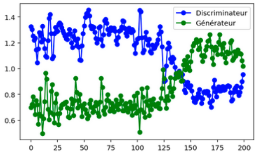

## Generating Piano (MIDI files) using three techniques :

- LSTM (like a prediction : so not a real generative model)
- VAE and Beta-VAE
- DCGAN

I put some of the .mid generated by the model with the script

### Here is an example of the partition of the music generated by the VAE :

### Here is the evolution of the loss of the DCGAN :

## TODO
- Conditional GAN
